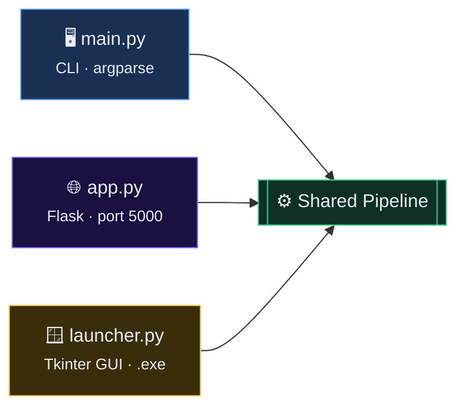
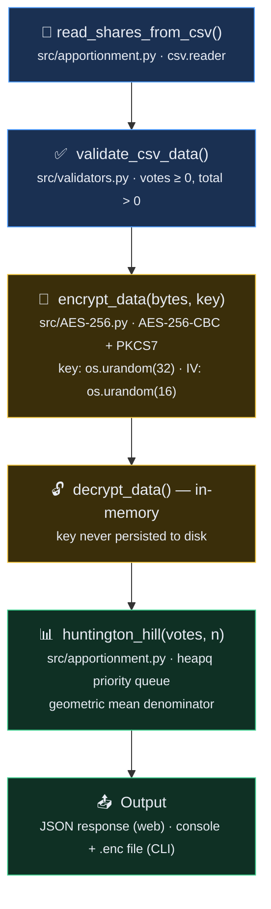
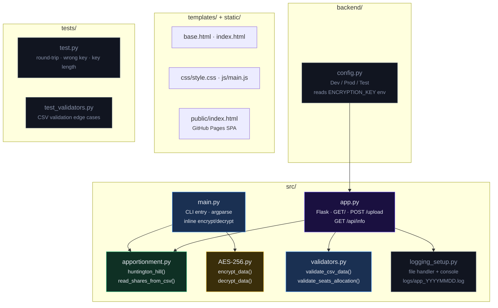
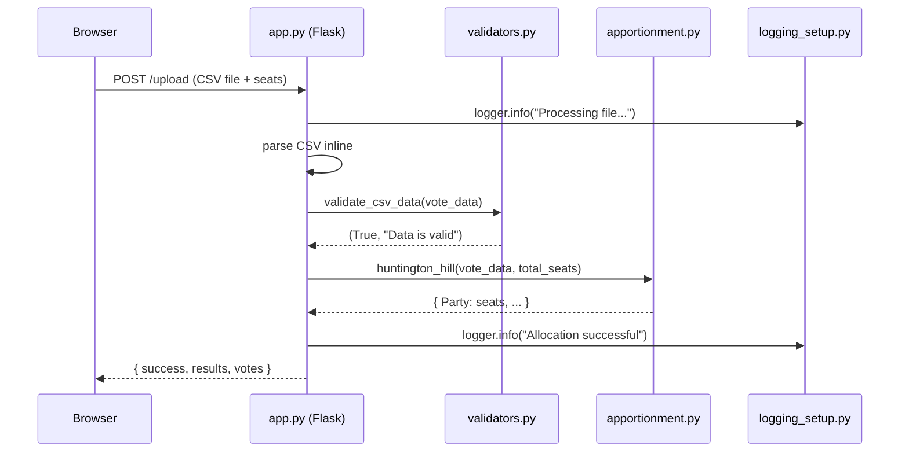
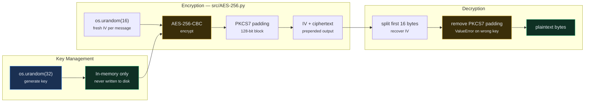

# Architecture

**Secure Apportionment System · v0.3.0**

> Huntington-Hill seat allocation with AES-256-CBC encryption.  
> Three entry points share a common pipeline. Modular, testable, CI-ready.

---

## Entry Points

Three distinct ways to run the system — all converge on the same core pipeline.



---

## Shared Pipeline

All entry points execute these six steps in order.



---

## Module Map



---

## Web Layer (app.py)



---

## Security Model



> ⚠️ **Known risk:** `main.py` CLI demo writes `key.bin` to disk.  
> In production: set `ENCRYPTION_KEY` as an environment variable and use `backend/config.py`.

---

## File Tree

```
Secure-Apportionment-System/
│
├── src/
│   ├── apportionment.py       ← core algorithm + CSV loader
│   ├── app.py                 ← Flask web entry point
│   ├── main.py                ← CLI entry point
│   ├── AES-256.py             ← encryption module
│   ├── validators.py          ← input validation
│   ├── logging_setup.py       ← logging config
│   └── __init__.py
│
├── backend/
│   ├── config.py              ← env-based config (Dev/Prod/Test)
│   ├── requirements.txt
│   └── pytest.ini
│
├── templates/
│   ├── base.html
│   └── index.html             ← Jinja2 web UI
│
├── static/
│   ├── css/style.css
│   └── js/main.js
│
├── public/
│   └── index.html             ← GitHub Pages SPA
│
├── tests/
│   ├── test.py                ← crypto round-trip tests
│   ├── test_validators.py     ← validation edge cases
│   └── __init__.py
│
├── docs/
│   ├── ARCHITECTURE.md        ← this file
│   ├── CHANGELOG.md
│   ├── ENCRYPTION.md
│   ├── THREAT_MODEL.md
│   ├── CONTRIBUTING.md
│   └── ssdlc.md
│
├── .github/workflows/
│   ├── tests.yml              ← CI on push
│   └── docker-publish.yml     ← container build
│
├── launcher.py                ← Tkinter GUI entry point
├── requirements.txt
├── Dockerfile
├── docker-compose.yml
├── installer.iss              ← Inno Setup config
├── run.bat                    ← Windows launcher
└── sample_*.csv               ← 11 election scenario datasets
```

---

## Known Gaps

| # | Issue | Location | Fix |
|---|---|---|---|
| 1 | `validate_seats_allocation()` never called | `src/app.py` /upload route | Call after parsing `total_seats` |
| 2 | Duplicate crypto logic | `src/main.py` vs `src/AES-256.py` | `main.py` should import from `AES-256.py` |
| 3 | Version mismatch | `docs/CHANGELOG.md` shows `1.0.0` | Reconcile with README `v0.x` |
| 4 | CSV output not implemented | `src/main.py` | Implement or remove from docs |

---

*Rendered with [Mermaid](https://mermaid.js.org). View on GitHub for live diagrams.*
